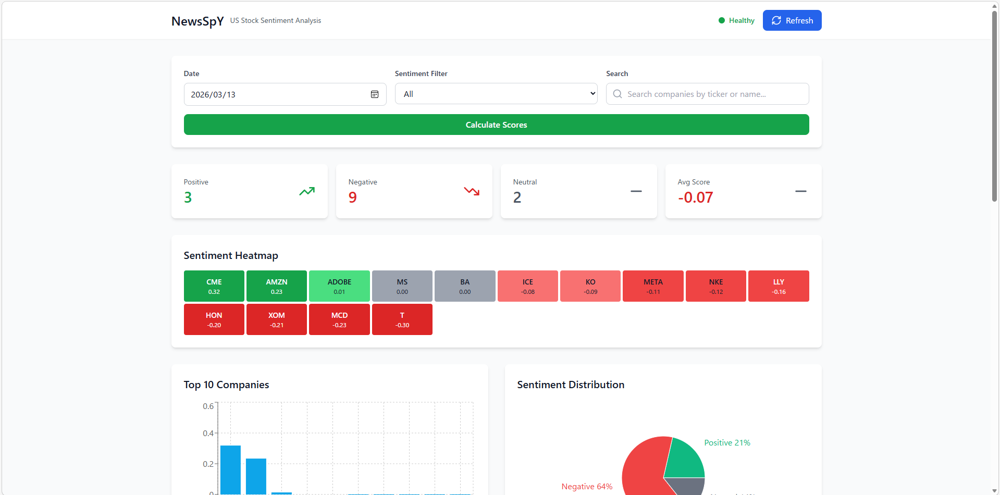

<div align="center">

# 📈 NewsSpY

### US Stock Sentiment Analysis Dashboard

*Collect → Analyze → Visualize — fully automated, AI-powered*

<br/>

[](https://www.python.org/)
[](https://fastapi.tiangolo.com/)
[](https://react.dev/)
[](https://www.typescriptlang.org/)
[](https://www.docker.com/)

<br/>

**[English](#english) · [中文](#chinese)**

</div>

---

<a name="english"></a>

<div align="center">

## 🖥 Demo

<!-- Replace with your actual screenshot or GIF -->


*Sentiment heatmap · Per-ticker time-series · Real-time ranking*

</div>

---

## 🌟 What is NewsSpY?

NewsSpY automatically fetches financial news for **44 NYSE companies**, runs each article through **FinBERT** (a BERT model fine-tuned on financial text), and presents the results as an interactive sentiment dashboard — updated daily.

```
News (GNews + yfinance)  →  FinBERT AI  →  JSON Files  →  FastAPI  →  React Dashboard
```

---

## ✨ Key Features

<table>
<tr>
<td width="50%">

**🤖 AI Sentiment Engine**
- FinBERT (`ProsusAI/finbert`) — finance-specific NLP
- 3-class output: Positive / Negative / Neutral
- Aggregated daily score per ticker

</td>
<td width="50%">

**📊 Interactive Dashboard**
- Color-coded sentiment heatmap (44 tickers)
- Time-series line chart per stock
- Real-time search across all companies

</td>
</tr>
<tr>
<td width="50%">

**📰 Smart News Collection**
- Multi-ticker batch fetch in a single API call
- Auto-classification to the correct ticker
- GNews API + yfinance as dual sources

</td>
<td width="50%">

**⏰ Pre-Market Focus**
- JST 06:00–22:00 filter (before US market open)
- News with highest trading impact
- Cron-based daily automation

</td>
</tr>
</table>

---

## 🏗 Architecture

```
┌──────────────────────────────────────────────────────┐
│                    Docker Compose                    │
│                                                      │
│   Browser ──▶ Nginx :80 ──▶ React + Vite (TS)       │
│                    │                                 │
│                    ▼                                 │
│             FastAPI /api/*                           │
│                    │                                 │
│                    ▼                                 │
│             JSON Files /app/data/json/              │
│                                                      │
│   ┌─────────────────────────────────────────────┐   │
│   │  Batch Worker  (manual: daily JST 6-22)      │   │
│   │  GNews API ──┐                              │   │
│   │              ├──▶ FinBERT ──▶ JSON Files     │   │
│   │  yfinance  ──┘                              │   │
│   └─────────────────────────────────────────────┘   │
└──────────────────────────────────────────────────────┘
```

---

## 🛠 Tech Stack

| Layer | Technology |
|:------|:-----------|
| **Backend** | FastAPI · Python 3.10+ · JSON File Storage |
| **AI / NLP** | FinBERT `ProsusAI/finbert` (HuggingFace) |
| **Data** | GNews API · yfinance |
| **Frontend** | React 18 · Vite · TypeScript · Tailwind CSS · Recharts |
| **UI** | Neon-themed Investment Dashboard |
| **Infra** | Docker · Docker Compose · Nginx |

---

## 📁 Project Structure

```
NewsSpY/
├── backend/
│   ├── app/
│   │   ├── main.py              # FastAPI application entry point
│   │   ├── config.py            # Configuration settings
│   │   ├── schemas.py           # Pydantic schemas
│   │   ├── routes/              # API route handlers
│   │   │   ├── articles.py      # Article endpoints
│   │   │   ├── scores.py        # Score endpoints
│   │   │   ├── sentiments.py    # Sentiment endpoints
│   │   │   ├── batch.py         # Batch processing endpoints
│   │   │   └── auth.py          # Authentication endpoints
│   │   └── services/            # Business logic
│   │       ├── json_storage.py         # JSON file storage
│   │       ├── sentiment_analyzer.py  # FinBERT integration
│   │       └── score_calculator.py   # Score calculation
│   ├── batch/                   # Batch processing scripts
│   │   ├── main.py              # Main batch processor
│   │   └── news_fetcher.py      # News fetching logic
│   ├── companies.json           # Company data
│   ├── Dockerfile               # Backend Docker config
│   └── requirements.txt         # Python dependencies
├── frontend/
│   ├── src/
│   │   ├── App.tsx              # Main application component
│   │   ├── main.tsx             # Entry point
│   │   ├── components/          # React components
│   │   │   ├── Heatmap.tsx      # Sentiment heatmap
│   │   │   ├── StockDetail.tsx  # Stock detail modal
│   │   │   └── Search.tsx       # Company search
│   │   ├── services/
│   │   │   └── api.ts           # API client
│   │   └── types/
│   │       └── index.ts         # TypeScript types
│   ├── Dockerfile               # Frontend Docker config
│   ├── package.json             # Node dependencies
│   └── vite.config.ts           # Vite configuration
├── nginx/
│   └── nginx.conf               # Nginx reverse proxy config
├── docker-compose.yml           # Docker Compose orchestration
└── README.md                    # This file
```

---

## 🚀 Quick Start

> **Prerequisite:** Docker 20.10+, a free [GNews API key](https://gnews.io/) (100 req/day)

```bash
# 1. Clone
git clone https://github.com/yuina368/NewsSpY.git && cd NewsSpY

# 2. Configure
cp .env.example .env
# → Set GNEWS_API_KEY in .env

# 3. Launch
docker-compose up -d

# 4. Fetch news & run sentiment analysis
docker exec newspy-backend python -m batch.main
```

| URL | Description |
|:----|:------------|
| http://localhost | 📊 Dashboard |
| http://localhost/api/docs | 📖 Swagger API Docs |

---

## 📡 API Endpoints

```
GET  /api/companies/                   → List all 44 companies
GET  /api/scores/ranking/{date}        → Daily sentiment ranking
GET  /api/scores/{ticker}              → Score time-series
GET  /api/articles/?ticker={ticker}    → News by ticker
GET  /api/sentiments/{ticker}          → Sentiment by ticker
```

---

## 📊 Tracked Companies (44)

<details>
<summary><b>View all tickers by sector</b></summary>
<br/>

| Sector | Tickers |
|:-------|:--------|
| 💻 Technology | `AAPL` `MSFT` `GOOGL` `AMZN` `TSLA` `META` `NVDA` `NFLX` `CRM` `ADBE` |
| 🏦 Financials | `JPM` `BAC` `WFC` `GS` `MS` `BLK` `ICE` `CME` `V` `MA` `AXP` |
| 🏥 Healthcare | `JNJ` `UNH` `PFE` `ABBV` `MRK` `TMO` `LLY` |
| 🛒 Consumer | `WMT` `KO` `PEP` `COST` `MCD` `NKE` `LOW` |
| ⚡ Energy / Industrial | `XOM` `CVX` `BA` `HON` `GE` |
| 📡 Telecom / Media | `VZ` `T` `CMCSA` `DIS` |

</details>

---

## ⏰ Time Filter Design

```
JST  00:00 ──────── 06:00 ════════════════════ 22:00 ──── 24:00
                      ↑                          ↑
                  [Analysis window begins]   [Cutoff — next day]
                  (pre-US market open)
```

Only news in the **JST 06:00–22:00 window** is analyzed, capturing the cycle with the highest impact on that day's US market session.

---

## 📄 License

MIT © [yuina368](https://github.com/yuina368)

---

<div align="center">

**[FinBERT](https://huggingface.co/ProsusAI/finbert)** · **[GNews API](https://gnews.io/)** · **[yfinance](https://pypi.org/project/yfinance/)**

</div>

---

<a name="chinese"></a>

<div align="center">

# 🇨🇳 NewsSpY

*自动收集 → AI 分析 → 可视化展示*

[](https://www.python.org/)
[](https://fastapi.tiangolo.com/)
[](https://react.dev/)
[](https://www.typescriptlang.org/)
[](https://www.docker.com/)

</div>

---

## 🌟 项目简介

NewsSpY 自动获取 **44 家 NYSE 上市公司**的财经新闻，通过 **FinBERT**（基于金融文本微调的 BERT 模型）分析每篇文章的情绪，并以交互式仪表板呈现结果——每日自动更新。

```
新闻 (GNews + yfinance)  →  FinBERT AI  →  JSON 文件  →  FastAPI  →  React 仪表板
```

---

## ✨ 核心功能

<table>
<tr>
<td width="50%">

**🤖 AI 情绪引擎**
- FinBERT — 金融领域专用 NLP
- 三分类：积极 / 消极 / 中性
- 每日每支股票聚合评分

</td>
<td width="50%">

**📊 交互式仪表板**
- 44 支股票色码情绪热力图
- 每支股票时序折线图
- 跨公司全文搜索

</td>
</tr>
<tr>
<td width="50%">

**📰 智能新闻收集**
- 单次 API 请求批量获取多支股票
- 自动分类到对应股票
- GNews API + yfinance 双数据源

</td>
<td width="50%">

**⏰ 开盘前聚焦**
- JST 06:00–22:00 过滤（美股开盘前）
- 捕捉对交易影响最大的新闻
- 基于 Cron 的每日自动化

</td>
</tr>
</table>

---

## 🛠 技术栈

| 层级 | 技术 |
|:-----|:-----|
| **后端** | FastAPI · Python 3.10+ · JSON 文件存储 |
| **AI / NLP** | FinBERT `ProsusAI/finbert` (HuggingFace) |
| **数据** | GNews API · yfinance |
| **前端** | React 18 · Vite · TypeScript · Tailwind CSS · Recharts |
| **界面** | 霓虹色投资仪表板 |
| **基础设施** | Docker · Docker Compose · Nginx |

---

## 🚀 快速开始

> **前提条件：** Docker 20.10+，免费的 [GNews API 密钥](https://gnews.io/)（100 次请求/天）

```bash
# 1. 克隆
git clone https://github.com/yuina368/NewsSpY.git && cd NewsSpY

# 2. 配置
cp .env.example .env
# → 在 .env 中设置 GNEWS_API_KEY

# 3. 启动
docker-compose up -d

# 4. 获取新闻并运行情绪分析
docker exec newspy-backend python -m batch.main
```

| URL | 说明 |
|:----|:-----|
| http://localhost | 📊 仪表板 |
| http://localhost/api/docs | 📖 Swagger API 文档 |

---

## 📡 API 端点

```
GET  /api/companies/                   → 列出所有 44 家公司
GET  /api/scores/ranking/{date}        → 每日情绪排名
GET  /api/scores/{ticker}              → 评分时序
GET  /api/articles/?ticker={ticker}    → 按股票获取新闻
GET  /api/sentiments/{ticker}          → 按股票获取情绪评分
```

---

## 📊 追踪标的（44 家）

<details>
<summary><b>按板块查看所有股票代码</b></summary>
<br/>

| 板块 | 股票代码 |
|:-----|:---------|
| 💻 科技 | `AAPL` `MSFT` `GOOGL` `AMZN` `TSLA` `META` `NVDA` `NFLX` `CRM` `ADBE` |
| 🏦 金融 | `JPM` `BAC` `WFC` `GS` `MS` `BLK` `ICE` `CME` `V` `MA` `AXP` |
| 🏥 医疗保健 | `JNJ` `UNH` `PFE` `ABBV` `MRK` `TMO` `LLY` |
| 🛒 消费品 | `WMT` `KO` `PEP` `COST` `MCD` `NKE` `LOW` |
| ⚡ 能源 / 工业 | `XOM` `CVX` `BA` `HON` `GE` |
| 📡 通信 / 媒体 | `VZ` `T` `CMCSA` `DIS` |

</details>

---

## ⏰ 时间过滤设计

```
JST  00:00 ──────── 06:00 ════════════════════ 22:00 ──── 24:00
                      ↑                          ↑
                  [分析窗口开始]              [截止 — 推至次日]
                  （美股开盘前）
```

仅分析 **JST 06:00–22:00** 发布的新闻，精准捕捉对当日美股交易影响最大的新闻周期。

---

## 📄 许可证

MIT © [yuina368](https://github.com/yuina368)

---

<div align="center">

**[FinBERT](https://huggingface.co/ProsusAI/finbert)** · **[GNews API](https://gnews.io/)** · **[yfinance](https://pypi.org/project/yfinance/)**

</div>