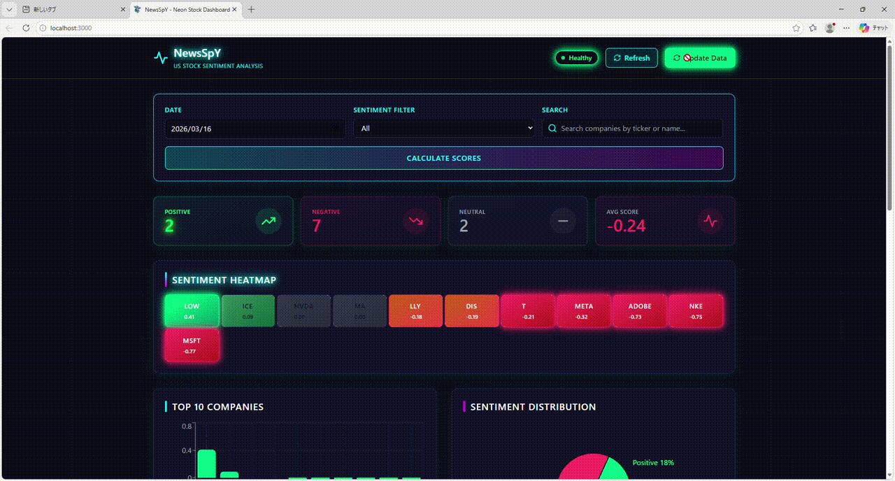

<div align="center">

# NewsSpY

### 🤖 AI-Powered Financial News Sentiment Analysis Platform

**Transform raw financial news into actionable market insights** using FinBERT — the state-of-the-art NLP model for financial sentiment analysis.

[](https://www.python.org/)
[](https://fastapi.tiangolo.com/)
[](https://react.dev/)
[](https://www.typescriptlang.org/)
[](https://www.docker.com/)
[](https://opensource.org/licenses/MIT)


**[English](#english) · [中文](#chinese)**

</div>

---

## 🎯 Why This Project Exists

Financial markets move on information — but the volume of daily news is overwhelming. Traders and analysts spend hours manually sifting through headlines to gauge market sentiment.

**NewsSpY automates this process** by:
- **Aggregating** financial news for 44 major US companies in real-time
- **Analyzing** sentiment using FinBERT (ProsusAI's financial NLP model)
- **Visualizing** trends through an interactive dashboard

Whether you're a quantitative trader, financial analyst, or developer exploring NLP applications, NewsSpY provides a complete, production-ready reference architecture for AI-powered financial analysis.

---

## 📸 Demo

### Dashboard Preview



*Neon-themed Investment Dashboard · Sentiment Heatmap · Time-series Charts*

### Sentiment Heatmap

| Ticker | Company | Sentiment Score | Articles Analyzed |
|--------|---------|-----------------|-------------------|
| NVDA | NVIDIA Corp | +0.89 | 142 |
| AAPL | Apple Inc. | +0.76 | 98 |
| TSLA | Tesla Inc. | -0.34 | 87 |

---

## ✨ Key Features

- **🧠 AI-Powered Analysis** — FinBERT sentiment analysis optimized for financial text
- **📊 Real-Time Dashboard** — Interactive charts and heatmaps built with React & Recharts
- **🔔 Smart Filtering** — Pre-market focused news (JST 06:00–22:00) for actionable insights
- **🔄 Automated Processing** — Daily batch processing with configurable schedules
- **🐳 Production-Ready** — Fully containerized with Docker & Docker Compose
- **⚡ Fast API** — RESTful endpoints powered by FastAPI
- **📈 44 Companies Tracked** — Comprehensive coverage of US large-cap stocks

---

## 🏗️ Architecture

```
┌─────────────────────────────────────────────────────────────────┐
│                         Data Sources                              │
│  ┌──────────────┐            ┌──────────────┐                   │
│  │   GNews API  │            │  yfinance    │                   │
│  └──────┬───────┘            └──────┬───────┘                   │
└─────────┼──────────────────────────┼────────────────────────────┘
          │                          │
          ▼                          ▼
┌─────────────────────────────────────────────────────────────────┐
│                    Sentiment Analysis Engine                      │
│  ┌─────────────────────────────────────────────────────────┐    │
│  │                   FinBERT NLP Model                      │    │
│  │           (ProsusAI/finbert on HuggingFace)             │    │
│  └─────────────────────────────────────────────────────────┘    │
└───────────────────────────────┬─────────────────────────────────┘
                                │
                                ▼
┌─────────────────────────────────────────────────────────────────┐
│                      Data Storage Layer                          │
│  ┌─────────────────────────────────────────────────────────┐    │
│  │                    JSON Files                            │    │
│  └─────────────────────────────────────────────────────────┘    │
└───────────────────────────────┬─────────────────────────────────┘
                                │
                                ▼
┌─────────────────────────────────────────────────────────────────┐
│                      API Gateway Layer                           │
│  ┌─────────────────────────────────────────────────────────┐    │
│  │                    FastAPI Server                        │    │
│  │              (Port 8000 behind Nginx)                    │    │
│  └─────────────────────────────────────────────────────────┘    │
└───────────────────────────────┬─────────────────────────────────┘
                                │
                                ▼
┌─────────────────────────────────────────────────────────────────┐
│                       Frontend Dashboard                          │
│  ┌─────────────────────────────────────────────────────────┐    │
│  │      React 18 + TypeScript + TailwindCSS + Recharts     │    │
│  └─────────────────────────────────────────────────────────┘    │
└─────────────────────────────────────────────────────────────────┘
```

---

## 🛠️ Tech Stack

| Layer | Technology | Purpose |
|-------|------------|---------|
| **Backend** | FastAPI, Python 3.10+ | High-performance API framework |
| **AI/NLP** | FinBERT | Financial sentiment analysis model |
| **Data Sources** | GNews API, yfinance | News aggregation & market data |
| **Frontend** | React 18, TypeScript, Vite | Modern reactive UI |
| **Styling** | TailwindCSS | Utility-first CSS framework |
| **Charts** | Recharts | Declarative data visualization |
| **Infrastructure** | Docker, Docker Compose, Nginx | Containerization & reverse proxy |

---

## 🚀 Quick Start

### Prerequisites

- Docker & Docker Compose installed
- GNews API key ([get one here](https://gnews.io/))

### Installation

```bash
# Clone the repository
git clone https://github.com/yuina368/NewsSpY.git
cd NewsSpY

# Configure your API key
echo "GNEWS_API_KEY=your_api_key_here" > .env

# Launch the full stack
docker-compose up -d

# Fetch news and run sentiment analysis
docker exec newspy-backend python -m batch.main

# Access the dashboard
open http://localhost
```

| URL | Description |
|:----|:------------|
| http://localhost | 📊 Dashboard |
| http://localhost/api/docs | 📖 Swagger API Docs |

---

## 🔌 API Endpoints

| Endpoint | Method | Description |
|----------|--------|-------------|
| `/api/companies/` | GET | List all tracked companies |
| `/api/scores/ranking/{date}` | GET | Sentiment ranking by date |
| `/api/scores/{ticker}` | GET | Historical sentiment scores |
| `/api/articles/?ticker={ticker}` | GET | News articles by ticker |
| `/api/sentiments/{ticker}` | GET | Raw sentiment data |

---

## 💡 Use Cases

- **Quantitative Trading** — Generate signals from news sentiment trends
- **Financial Analysis** — Quick overview of market perception
- **NLP Research** — Reference implementation for financial text analysis
- **Portfolio Monitoring** — Track sentiment across holdings
- **Educational** — Learn production ML/AI system architecture

---

## 🗺️ Roadmap

- [ ] Additional sentiment models (VADER, BERT variants)
- [ ] Multi-language news support
- [ ] Real-time WebSocket updates
- [ ] Custom time range filtering
- [ ] Export to CSV/Excel
- [ ] Alert system for sentiment spikes
- [ ] Backtesting framework for sentiment-based strategies

---

## 📁 Project Structure

```
NewsSpY/
├── backend/
│   ├── app/
│   │   ├── main.py              # FastAPI application entry point
│   │   ├── config.py            # Configuration settings
│   │   ├── schemas.py           # Pydantic schemas
│   │   ├── routes/              # API route handlers
│   │   │   ├── articles.py      # Article endpoints
│   │   │   ├── scores.py        # Score endpoints
│   │   │   ├── sentiments.py    # Sentiment endpoints
│   │   │   ├── batch.py         # Batch processing endpoints
│   │   │   └── auth.py          # Authentication endpoints
│   │   └── services/            # Business logic
│   │       ├── json_storage.py         # JSON file storage
│   │       ├── sentiment_analyzer.py  # FinBERT integration
│   │       └── score_calculator.py   # Score calculation
│   ├── batch/                   # Batch processing scripts
│   │   ├── main.py              # Main batch processor
│   │   └── news_fetcher.py      # News fetching logic
│   ├── companies.json           # Company data
│   ├── Dockerfile               # Backend Docker config
│   └── requirements.txt         # Python dependencies
├── frontend/
│   ├── src/
│   │   ├── App.tsx              # Main application component
│   │   ├── main.tsx             # Entry point
│   │   ├── components/          # React components
│   │   │   ├── Heatmap.tsx      # Sentiment heatmap
│   │   │   ├── StockDetail.tsx  # Stock detail modal
│   │   │   └── Search.tsx       # Company search
│   │   ├── services/
│   │   │   └── api.ts           # API client
│   │   └── types/
│   │       └── index.ts         # TypeScript types
│   ├── Dockerfile               # Frontend Docker config
│   ├── package.json             # Node dependencies
│   └── vite.config.ts           # Vite configuration
├── nginx/
│   └── nginx.conf               # Nginx reverse proxy config
├── docker-compose.yml           # Docker Compose orchestration
└── README.md                    # This file
```

---

## 📊 Tracked Companies (44)

<details>
<summary><b>View all tickers by sector</b></summary>
<br/>

| Sector | Tickers |
|:-------|:--------|
| 💻 Technology | `AAPL` `MSFT` `GOOGL` `AMZN` `TSLA` `META` `NVDA` `NFLX` `CRM` `ADBE` |
| 🏦 Financials | `JPM` `BAC` `WFC` `GS` `MS` `BLK` `ICE` `CME` `V` `MA` `AXP` |
| 🏥 Healthcare | `JNJ` `UNH` `PFE` `ABBV` `MRK` `TMO` `LLY` |
| 🛒 Consumer | `WMT` `KO` `PEP` `COST` `MCD` `NKE` `LOW` |
| ⚡ Energy / Industrial | `XOM` `CVX` `BA` `HON` `GE` |
| 📡 Telecom / Media | `VZ` `T` `CMCSA` `DIS` |

</details>

---

## 📄 License

This project is licensed under the MIT License — see the [LICENSE](LICENSE) file for details.

---

<div align="center">

**[⬆ Back to Top](#newspy)**

Made with ❤️ by [yuina368](https://github.com/yuina368)

**[FinBERT](https://huggingface.co/ProsusAI/finbert)** · **[GNews API](https://gnews.io/)** · **[yfinance](https://pypi.org/project/yfinance/)**

</div>

---

<a name="chinese"></a>

<div align="center">

# 🇨🇳 NewsSpY

### 🤖 AI 驱动的金融新闻情感分析平台

**利用 FinBERT 将原始财经新闻转化为可操作的市场洞察** —— 专为金融文本优化的最先进 NLP 模型。

[](https://www.python.org/)
[](https://fastapi.tiangolo.com/)
[](https://react.dev/)
[](https://www.typescriptlang.org/)
[](https://www.docker.com/)
[](https://opensource.org/licenses/MIT)

[功能特性](#-核心功能) · [快速开始](#-快速开始) · [API](#-api-端点) · [架构](#-架构)

</div>

---

## 🎯 为什么做这个项目

金融市场随着信息而波动 —— 但每日新闻的体量令人难以招架。交易员和分析师需要花费数小时手动筛选标题来衡量市场情绪。

**NewsSpY 自动化这一过程**：
- **聚合** 44 家美国主要公司的实时财经新闻
- **分析** 使用 FinBERT（ProsusAI 的金融 NLP 模型）的情感
- **可视化** 通过交互式仪表板展示趋势

无论你是量化交易员、金融分析师，还是探索 NLP 应用的开发者，NewsSpY 都提供了 AI 驱动金融分析的完整、生产级参考架构。

---

## 📸 演示

### 仪表板预览


*霓虹主题投资仪表板 · 情绪热力图 · 时序图表*

### 情绪热力图

| 代码 | 公司名称 | 情绪评分 | 分析文章数 |
|--------|---------|-----------------|-------------------|
| NVDA | 英伟达 | +0.89 | 142 |
| AAPL | 苹果 | +0.76 | 98 |
| TSLA | 特斯拉 | -0.34 | 87 |

---

## ✨ 核心功能

- **🧠 AI 驱动分析** — 针对金融文本优化的 FinBERT 情感分析
- **📊 实时仪表板** — 基于 React & Recharts 的交互式图表和热力图
- **🔔 智能过滤** — 聚焦盘前新闻（JST 06:00–22:00）获取可操作洞察
- **🔄 自动化处理** — 可配置调度的每日批处理
- **🐳 生产就绪** — 使用 Docker & Docker Compose 完全容器化
- **⚡ 快速 API** — 由 FastAPI 驱动的 RESTful 端点
- **📈 跟踪 44 家公司** — 全面覆盖美国大市值股票

---

## 🏗️ 架构

```
┌─────────────────────────────────────────────────────────────────┐
│                         数据源                                    │
│  ┌──────────────┐            ┌──────────────┐                   │
│  │   GNews API  │            │  yfinance    │                   │
│  └──────┬───────┘            └──────┬───────┘                   │
└─────────┼──────────────────────────┼────────────────────────────┘
          │                          │
          ▼                          ▼
┌─────────────────────────────────────────────────────────────────┐
│                    情感分析引擎                                   │
│  ┌─────────────────────────────────────────────────────────┐    │
│  │                   FinBERT NLP 模型                       │    │
│  │           (ProsusAI/finbert on HuggingFace)             │    │
│  └─────────────────────────────────────────────────────────┘    │
└───────────────────────────────┬─────────────────────────────────┘
                                │
                                ▼
┌─────────────────────────────────────────────────────────────────┐
│                      数据存储层                                   │
│  ┌─────────────────────────────────────────────────────────┐    │
│  │                    JSON 文件                             │    │
│  └─────────────────────────────────────────────────────────┘    │
└───────────────────────────────┬─────────────────────────────────┘
                                │
                                ▼
┌─────────────────────────────────────────────────────────────────┐
│                      API 网关层                                   │
│  ┌─────────────────────────────────────────────────────────┐    │
│  │                    FastAPI 服务器                        │    │
│  │              (Nginx 后面的 8000 端口)                     │    │
│  └─────────────────────────────────────────────────────────┘    │
└───────────────────────────────┬─────────────────────────────────┘
                                │
                                ▼
┌─────────────────────────────────────────────────────────────────┐
│                       前端仪表板                                   │
│  ┌─────────────────────────────────────────────────────────┐    │
│  │      React 18 + TypeScript + TailwindCSS + Recharts     │    │
│  └─────────────────────────────────────────────────────────┘    │
└─────────────────────────────────────────────────────────────────┘
```

---

## 🛠️ 技术栈

| 层级 | 技术 | 用途 |
|-------|------------|---------|
| **后端** | FastAPI, Python 3.10+ | 高性能 API 框架 |
| **AI/NLP** | FinBERT | 金融情感分析模型 |
| **数据源** | GNews API, yfinance | 新闻聚合与市场数据 |
| **前端** | React 18, TypeScript, Vite | 现代响应式 UI |
| **样式** | TailwindCSS | 实用优先的 CSS 框架 |
| **图表** | Recharts | 声明式数据可视化 |
| **基础设施** | Docker, Docker Compose, Nginx | 容器化与反向代理 |

---

## 🚀 快速开始

### 前置要求

- 已安装 Docker & Docker Compose
- GNews API 密钥（[在此获取](https://gnews.io/)）

### 安装

```bash
# 克隆仓库
git clone https://github.com/yuina368/NewsSpY.git
cd NewsSpY

# 配置 API 密钥
echo "GNEWS_API_KEY=your_api_key_here" > .env

# 启动完整栈
docker-compose up -d

# 获取新闻并运行情感分析
docker exec newspy-backend python -m batch.main

# 访问仪表板
open http://localhost
```

| URL | 说明 |
|:----|:------------|
| http://localhost | 📊 仪表板 |
| http://localhost/api/docs | 📖 Swagger API 文档 |

---

## 🔌 API 端点

| 端点 | 方法 | 说明 |
|----------|--------|-------------|
| `/api/companies/` | GET | 列出所有跟踪的公司 |
| `/api/scores/ranking/{date}` | GET | 按日期的情绪排名 |
| `/api/scores/{ticker}` | GET | 历史情绪评分 |
| `/api/articles/?ticker={ticker}` | GET | 按代码获取新闻文章 |
| `/api/sentiments/{ticker}` | GET | 原始情绪数据 |

---

## 💡 使用场景

- **量化交易** — 从新闻情绪趋势生成信号
- **金融分析** — 快速了解市场认知
- **NLP 研究** — 金融文本分析的参考实现
- **投资组合监控** — 跟踪持仓的情绪变化
- **教育学习** — 学习生产级 ML/AI 系统架构

---

## 🗺️ 路线图

- [ ] 额外的情感模型（VADER、BERT 变体）
- [ ] 多语言新闻支持
- [ ] 实时 WebSocket 更新
- [ ] 自定义时间范围过滤
- [ ] 导出到 CSV/Excel
- [ ] 情绪飙升警报系统
- [ ] 基于情绪策略的回测框架

---

## 📁 项目结构

```
NewsSpY/
├── backend/
│   ├── app/
│   │   ├── main.py              # FastAPI 应用入口
│   │   ├── config.py            # 配置设置
│   │   ├── schemas.py           # Pydantic 模式
│   │   ├── routes/              # API 路由处理器
│   │   │   ├── articles.py      # 文章端点
│   │   │   ├── scores.py        # 评分端点
│   │   │   ├── sentiments.py    # 情绪端点
│   │   │   ├── batch.py         # 批处理端点
│   │   │   └── auth.py          # 认证端点
│   │   └── services/            # 业务逻辑
│   │       ├── json_storage.py         # JSON 文件存储
│   │       ├── sentiment_analyzer.py  # FinBERT 集成
│   │       └── score_calculator.py   # 评分计算
│   ├── batch/                   # 批处理脚本
│   │   ├── main.py              # 主批处理器
│   │   └── news_fetcher.py      # 新闻获取逻辑
│   ├── companies.json           # 公司数据
│   ├── Dockerfile               # 后端 Docker 配置
│   └── requirements.txt         # Python 依赖
├── frontend/
│   ├── src/
│   │   ├── App.tsx              # 主应用组件
│   │   ├── main.tsx             # 入口点
│   │   ├── components/          # React 组件
│   │   │   ├── Heatmap.tsx      # 情绪热力图
│   │   │   ├── StockDetail.tsx  # 股票详情模态框
│   │   │   └── Search.tsx       # 公司搜索
│   │   ├── services/
│   │   │   └── api.ts           # API 客户端
│   │   └── types/
│   │       └── index.ts         # TypeScript 类型
│   ├── Dockerfile               # 前端 Docker 配置
│   ├── package.json             # Node 依赖
│   └── vite.config.ts           # Vite 配置
├── nginx/
│   └── nginx.conf               # Nginx 反向代理配置
├── docker-compose.yml           # Docker Compose 编排
└── README.md                    # 本文件
```

---

## 📊 跟踪公司（44 家）

<details>
<summary><b>按板块查看所有股票代码</b></summary>
<br/>

| 板块 | 股票代码 |
|:-------|:--------|
| 💻 科技 | `AAPL` `MSFT` `GOOGL` `AMZN` `TSLA` `META` `NVDA` `NFLX` `CRM` `ADBE` |
| 🏦 金融 | `JPM` `BAC` `WFC` `GS` `MS` `BLK` `ICE` `CME` `V` `MA` `AXP` |
| 🏥 医疗保健 | `JNJ` `UNH` `PFE` `ABBV` `MRK` `TMO` `LLY` |
| 🛒 消费品 | `WMT` `KO` `PEP` `COST` `MCD` `NKE` `LOW` |
| ⚡ 能源 / 工业 | `XOM` `CVX` `BA` `HON` `GE` |
| 📡 通信 / 媒体 | `VZ` `T` `CMCSA` `DIS` |

</details>

---

## 📄 许可证

本项目采用 MIT 许可证 — 详情见 [LICENSE](LICENSE) 文件。

---

<div align="center">

**[⬆ 返回顶部](#newspy-1)**

由 [yuina368](https://github.com/yuina368) 用 ❤️ 制作

**[FinBERT](https://huggingface.co/ProsusAI/finbert)** · **[GNews API](https://gnews.io/)** · **[yfinance](https://pypi.org/project/yfinance/)**

</div>
